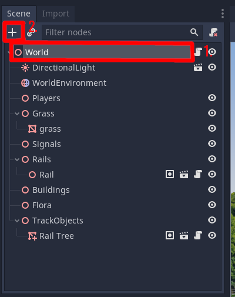
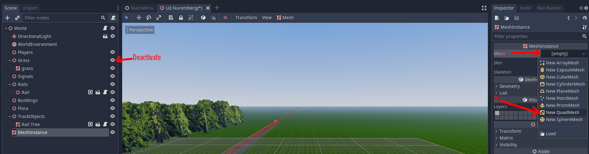
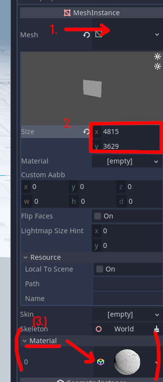
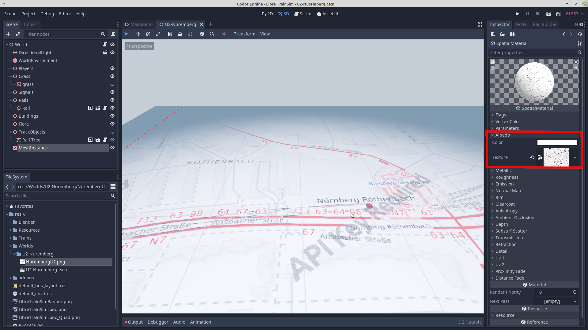
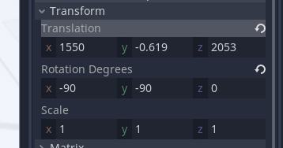

# Getting started

## Download and Installation

With the release of v0.9 we migrated to our new in game editor, thus you absolutely need to have the game installed.

## World creation

The editor is split into two parts: There is the world editor used to create the map and the scenario editor for the later scenario creation.

!!! warning "Weird UX"
    For reasons unknown to mankind the world creation workflow is not straight forward. First, enter the map name in the description then click on new afterwards.

!!! note "Editor data location"
    The shown file path `user://editor/` is a godot specific file path. The engine takes care of the real location on your machine. Do yourself the favor and stick to the default path. However, if you plan to take advantage of the modding capabilities then a change to `res://mods/` is required.

    Refer to the [modding tutorial](/manual/mods/) for further instructions.

## Camera controls

Our camera operates in two main modes: fly/first-Person mode and orbit mode.

### Fly/First-Person Mode

* Press `RMB` to enter the fly mode.
* Use `WASDQE` to move the camera.
* Move the `mouse` to look around.
* Press `Shift` to move faster.
* Additionally, the camera automatically accelerates the longer you hold `RMB`.

> I think the mouse wheel did something as well...

### Orbit mode

The orbit mode is the default camera mode and always active.

* Rotate your view using `MMB`.
* Move on the orbit plane (you want to use that even if you don't know what it means) using `Shift + MMB`.
* Move on the local plane by pressing `Alt + MMB`.
* Zoom using the `mouse wheel` or `Ctrl + MMB`.

## Base image

!!! danger "Unsupported feature"
    This feature is currently not supported in the editor. If you set up the map as a mod, you can add it as a base plane for the chunk following the steps below. This [issue is known and to be fixed](https://github.com/Libre-TrainSim/Libre-TrainSim/issues/399).

!!! note "Docs merging note"

	Only images were copied. No content verification.

Now we need our Track Concept, which we created [here](01-first-steps.md#conception-phase). Open your newly created world, select in the Scene Tab the top node 'World', then click on '+', and search for 'MeshInstance', then click on create. Deactivate the visibilty of the 'Grass' node in the scene tree. its the right icon, which looks like an eye.

 You could give it a special name if you like by doubleclicking it. Make sure it is selected, and select your Inspector at the right screen.  Select '[empty]' under Mesh, and select 'New QuadMesh'.

Now it will gonna be a bit complex:
You need the meter/pixel ratio of your image. If you where using the osm image, you need to count the pixels of the scale bar in your generated png image. You can find the scale bar at the left bottom corner. I count them with gimp: Open the image with gimp, zoom to the left bottom corner, press 'shift m' and drag the tool along the scale bar. In my case I counted 97 Pixels. Above the scale bar there is standing 50m. So my meter/pixel ratio is 50/97.
Also get the size in pixels of your ground.png file you can find it in gimp with 'alt enter'. In my case it is 9342 x 7041 Pixels.
Now woe need to get the height and the width of our plane.
In my case:
- X = 9342 * 50/97 = 4815 (m)
- Y = 7041 * 50/97 = 3629 (m)

Now we have our plane size. That we apply to our plane in Godot: 

Press 'ctrl s' ;) Now under the plane settings you will find a material. Create a new Spatial Material, click it, and under albedo you will see a empty texture field. Drag and Drop the large .png image to this empty texture field. This could take some seconds.
After that it will look like this:

Select the Mesh Instance again. In the Inspector further below you will find Transformation Settings. Set the Rotation Degrees to: x: -90 y: -90 z: 0
Now you could Adjust the Transformation from the Plane your track will start near the origin of the world. Also make sure to set the y coordinate to something below 0:

Great. Now your world is prepared for building!

## Dos
- Save often, save early.
- Use version control or at least backup your files regularly.
- Only use assets, if you have the rights for it. Best look for assets, which are licensed under [CC0](https://creativecommons.org/publicdomain/zero/1.0/deed.de). [OpenGameArt](https://opengameart.org/) is a nice site, where you find many assets licensed under CC0. (CC0 isn't required, but it makes a lot easier). [cc0textures](https://cc0textures.com/) has also very good textures. At the point we don't use normal maps etc, but if you want you could do this. Godot supports them.

## Don'ts
- Giving it up - If you have problem feel free to open a new issue. Together we will solve your Problem: [Click Here](https://github.com/Libre-TrainSim/Libre-TrainSim/issues/new). Feel free to contact Jean via Discord: https://www.libre-trainsim.de/links