# Building Rails

This article introduces the various features that aid rail building.

You can move rails by dragging their end (red arrow). When dragged to another snapping point (red or green arrow), the editor can sometimes automatically insert a filler rail. However in most cases you'll need to tweak the numbers to create working switches.

!!! note "Docs merging note"
    Language needs to be revised.

!!! danger "Update info"
    Needs new screenshots.

## Rail Builder

Let's start with an overview of the `RailBuilder`.

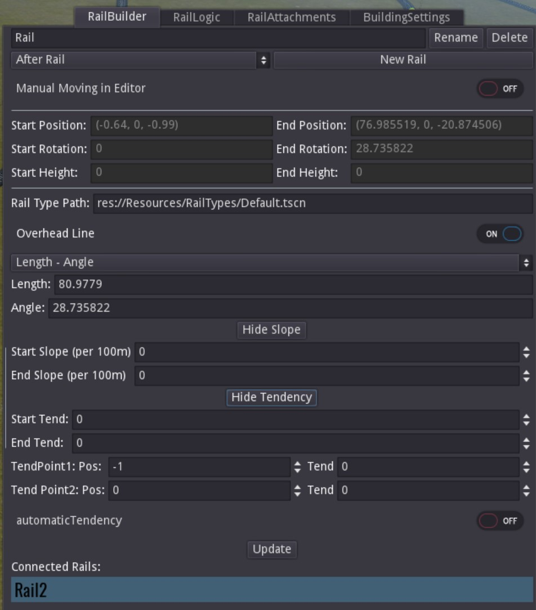

1. Rename or delete the rail. 
2. Add a new rail in one of these modes:
    - *After Rail* adds a rail after the currently selected one. 
    - *Parallel To* adds a rail next to the currently selected rail. See the information below for more information.
    - *Before Rail* adds a rail in front of the currently selected rail.
3. Shows read-only stats of the rails rotation, position, and height.
4. Defines the rail type.
5. Defines the rails geometry. All rails have two of the three following parameters:
    - *Length* sets the length of the rail up to a maximum of `1000` metres.
    - *Radius* sets the curveture. A radius of 0 is treated as a straight rail. A value of 100 is very sharp whereas a value of 10000 is almost straight.
    - *Angle* sets the change in rotation.
6. Defines the slope of the rail.
7. Defines the tendency of the rail.
8. Press this `Update` button or `enter` in any field to apply changes. **There's no undo!**
9.  Shows the calculated rail connections.

!!! tip
    The most used rail building mode is probably `Length - Angle` directly followed by `Length - Radius`.

`Manual Moving in Editor` prevents accidential movement of rails when deactivated.

!!! warning "Weird UX"
    Right now this setting is saved individually for each rail.

## Basics in Rail Building

Every rail has a start and an end arrow. The green one is the start point, the red one the end point. 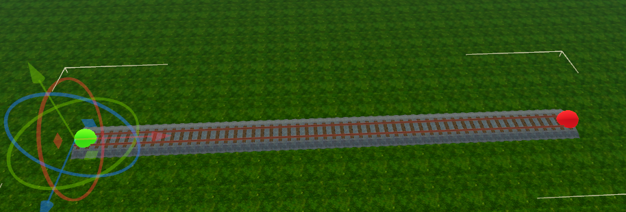

There's prelimary drag and drop support for rails when dragging their end arrow. Note though that most connections can't be made automatically.

The route baking calculates connected rails at run-time by comparing the position and rotation of the rails. Here are some examples:

- These rails are well connected. Trains can drive them perfectly. 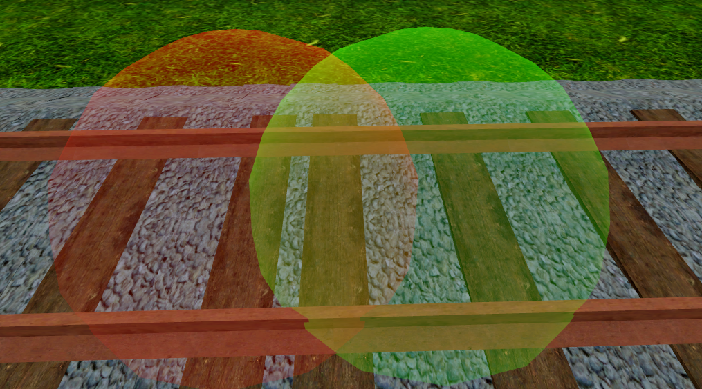
- These rails are messily connected but  trains can still use them. 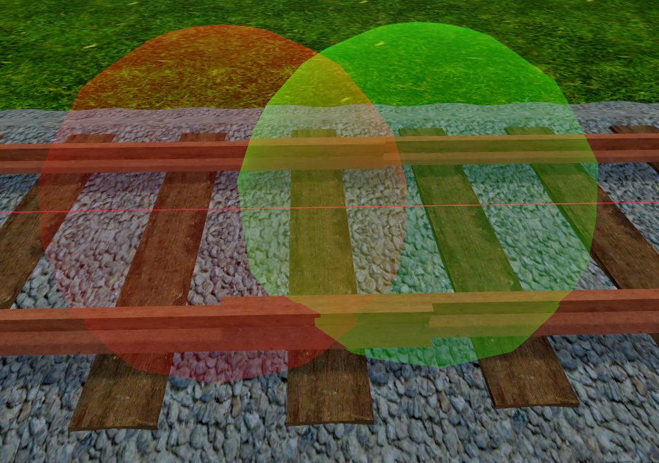
- The position of both rails is perfectly aligned but their rotation is too different. Trains cannot drive them 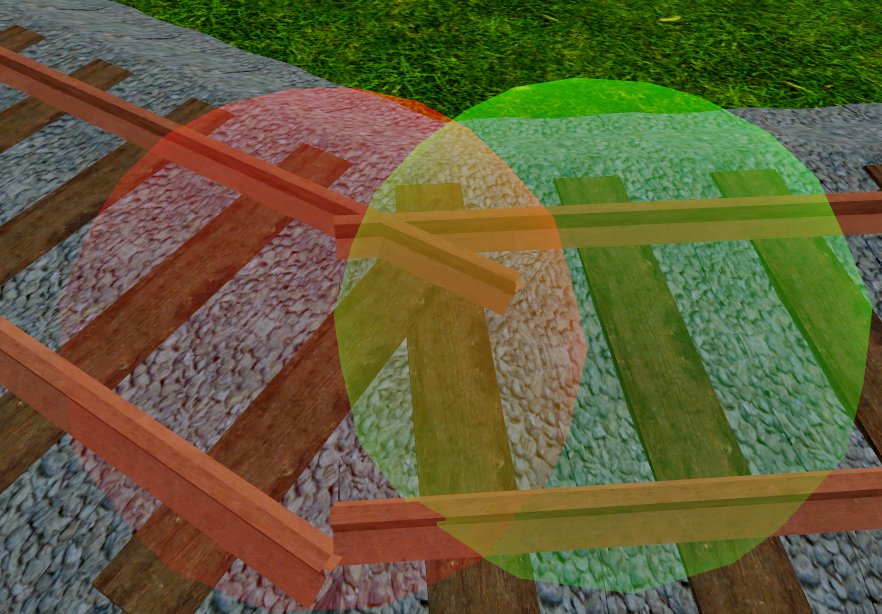
- The rotation of both rails is perfect but the distance between them is too wide. Trains cannot use these, too. 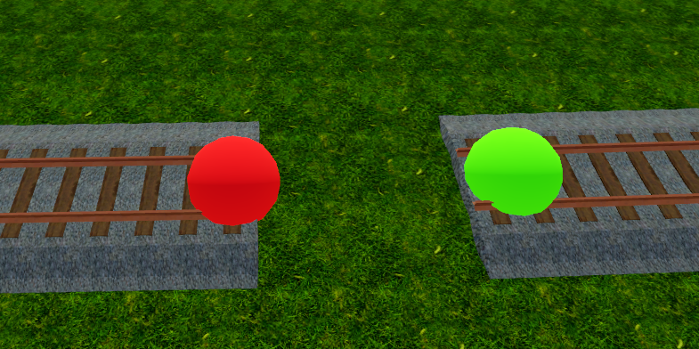

### Is there any other connection between the rails except the same location and rotation?

No, there is no further magic. The routes are calculated every start of the game based on the rail locations and rotations.

### How do switches work technically?

Libre TrainSim does not have real switches. Switches are built by adding another rail to the end of a rail. That way multiple rails are connected.

!!! note "Docs merging note"
    This info here is very good. Perhaps this should be moved to an easier findable position. It doesn't really make sense in a step by step guide.

## Switch Recipes

Here, you'll find some blueprints for common switches.

!!! note "Docs merging note
    We should add step by step gifs here.

### Basic Switch

1. Determine where your switch should start. Here it starts at the end.
2. Select the rail and in the rail builder select `After Rail` and `New Rail`. You should end up something like this: 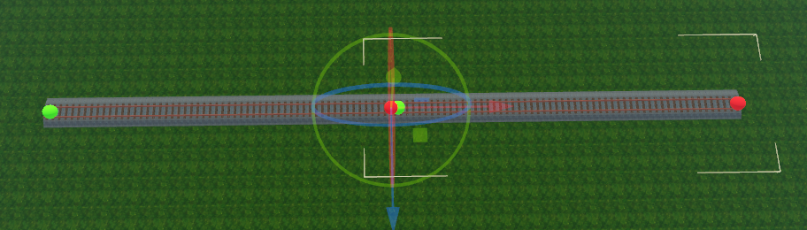
3. Now select the first rail and add a new rail after it again. Change the radius or angle and update it. 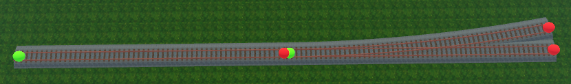

Congratulations! You built your first switch!

### One-way to two-way switch

1. Start with a straight rail, add a rail after it, and adjust the length of it. (It will later be the length of the whole curve) Start with something like 150 metres.
2. Add another rail to the newly created rail. 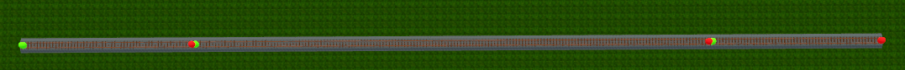
3. Select the newly created, third rail and add a parallel rail. Set the distance to something like `4.5` metres.
4. Select the new one and create a new rail after it.
5. Drag the end of the rail to the other beginning. A popup prompting to fix the rail connection opens.
6. Click `OK`.
7. The result should look like this: 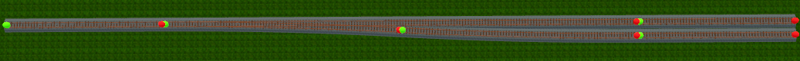

### Curved Switch

1. Start with a rail, add one after it, and set its angle to `10` degrees and its length to `100` metres.
2. Add another rail after, and add a parallel rail whith a distance of `-4.5` metres. 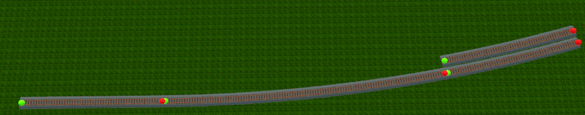
3. Select the first rail, add another rail after it.
4. Set the new rails angle to the same as the other switch leg (it's the value used in step one, so `10` in this example).
5. Reduce the length as much as possible to create the longest straight line possible between the new leg and the other parallel rail. `45` metres seem good in this example. 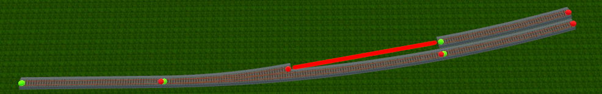
6. Connect both rails by dragging one end. 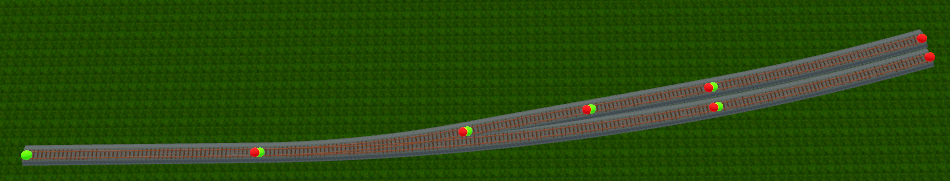

### Double Cross

1. Start with a straight rail and add three rails with the same length.
2. Add another rail that can be as long as you want. 
3. Add two parallel rails as shown. 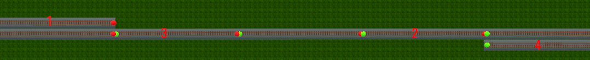
4. Connect rails one and two and rails three and four by dragging the rails. 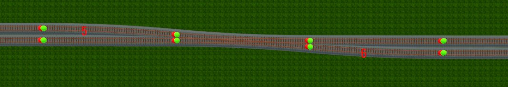
5. Connect rails five and six.
6. Delete any unwanted rails. 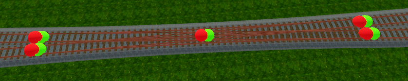

## Slope

!!! warning
    This feature is unstable. Please notify us of any issues you come across.

Rails can change height by changing their slope settings. Slopes are defined at the start and end points.

!!! note
    Slopes is calculated as a circle.

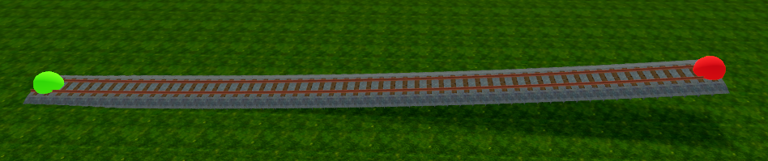

Slopes are also applied to parallel rails and can be combined with tendency.

!!! warning
    The big issue with our slope implementation is controlling the height. While it's possible - as demonstrated in the rail curve settings - it is deemed unnecessarily complex right now. This stance may change in the future when terrain gets implemented.

1. Add a `50` metres long rail and set the start slope to `0` and the end slope to `7`. 
2. Add a rail behind and set its length to 200. 
3. The end height of the rail is now `15.74646`. To get to almost exact 20 meters, add another rail and set its end slope to `0`.
4. Reduce the length until the end height is reached.

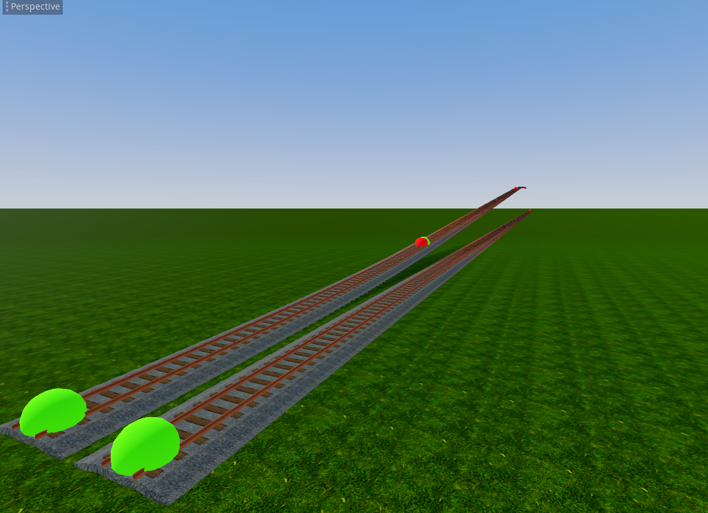

!!! warning
    Do not build switches since parallel rails are the only ones supporting matched slopes. Drag and drop will not work either.

    While you could tweak values until the rails work, it's going to be messy and a pain in the a...

## Tendency

Train curves work because certain forces work against each other. Tilting helps to increase the inward force and as such allows curves to be driven faster.

### Simple Tendency

The tendency is defined by a start and end value. In this example the rail is 200 metres long and the tilt is set to `4` degrees at both start and end points. 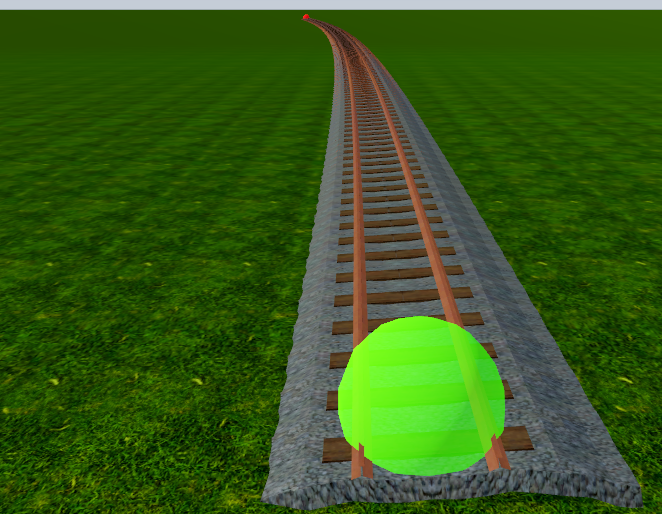

You need another rail in front and one behind that tilt into and out of the curve with this setup.

### Advanced Tendency

!!! tip
    Use automatic tendency. It will ease your life significantly.

    Manual setting of these values is considered bad UX and may be removed entirely in favor of the automatic approach. Please let us know if you have a non-covered use case.

In the real world clothoids are used. They are special because they continously transition into the curve. Thus the tilt can also slowly transition. However as we don't have them, we have to tilt the adjacent rails or use the method described hereafter.

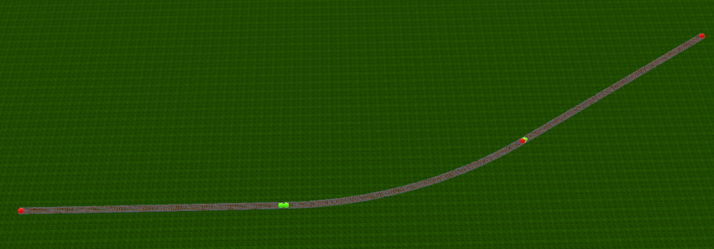

You can use three or four tendency points to describe the transition, too. To use only three points, set the position of `Tend Point2` to `-1`. 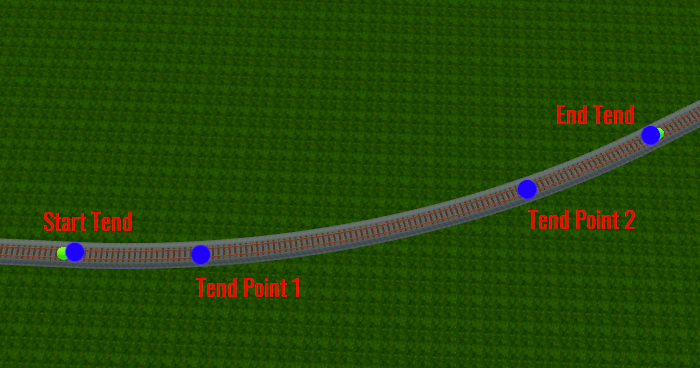

In this example we use two points. Since the curve is about a hundred metres long, we assert a fifth on each side for the transition. 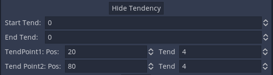

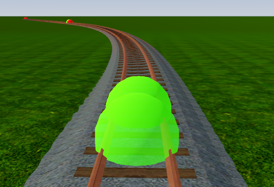

## Parallel Rails

!!! note "Docs merging note"
    Still valid? Not revised.

Parallel rails are specially treated. They inherent their values from the linked rail. The only setting you can adjust is the offset to the linked rail. If the linked rail is deleted, the rail becomes useless and needs to be deleted, too.

---

## [YouTube Video](https://youtu.be/p0ycRpTUvfM)
