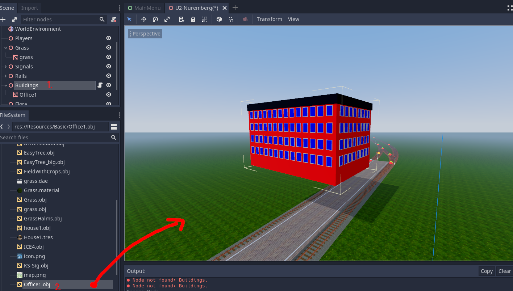
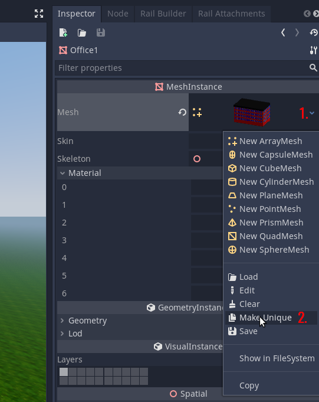
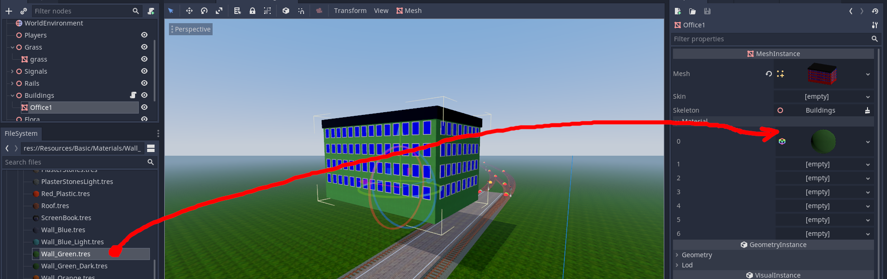
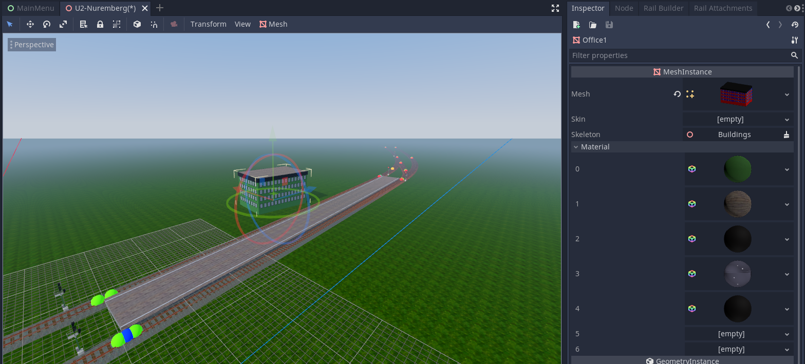
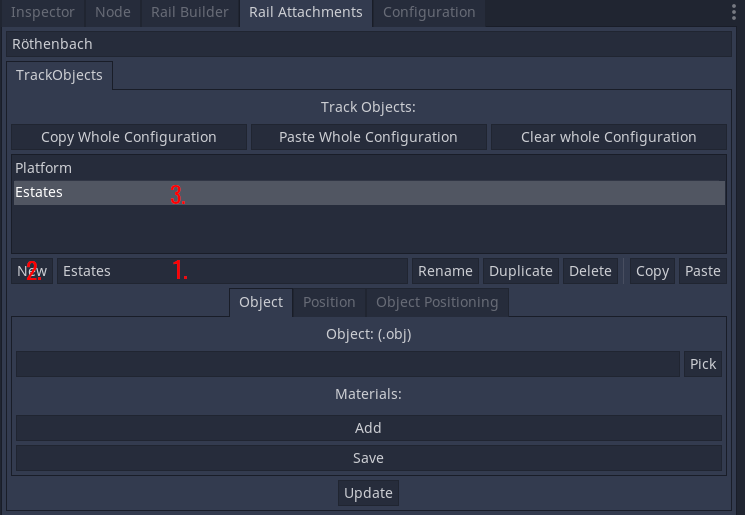
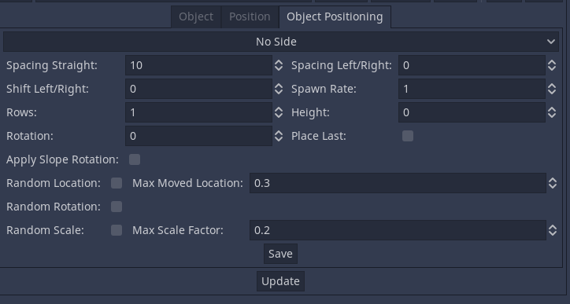
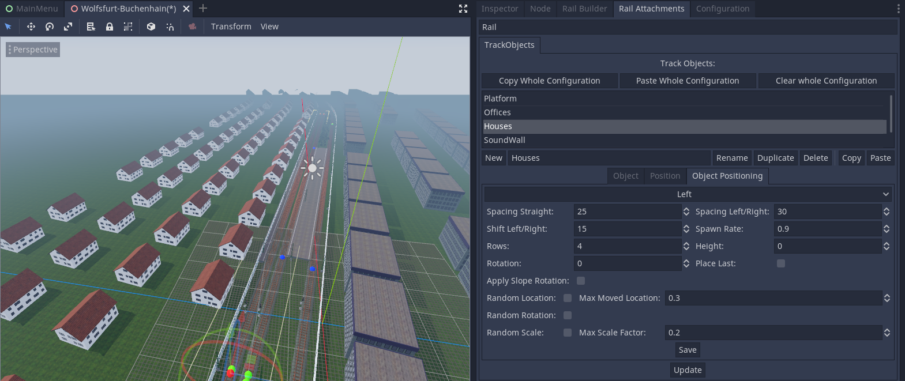
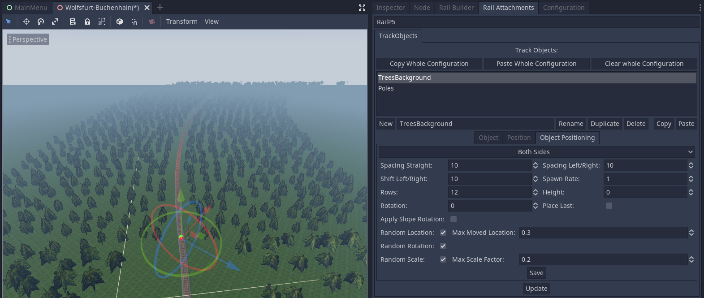
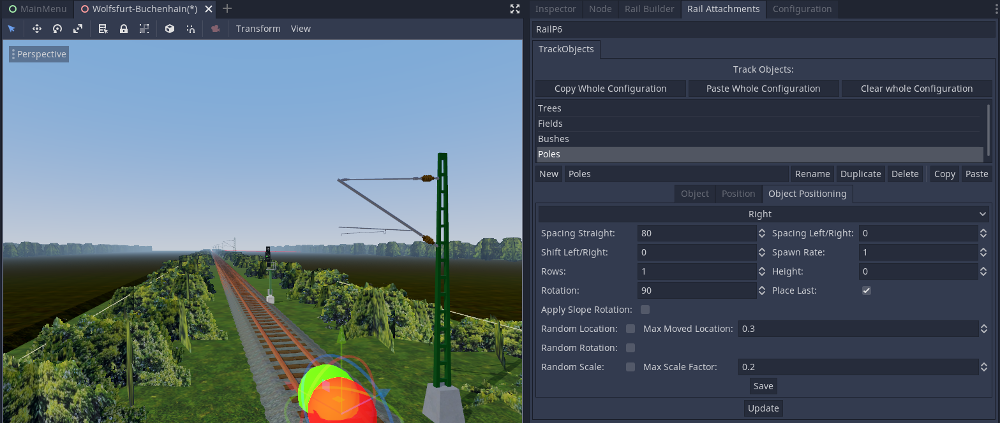

# Adding Landscape

!!! note "Docs merging note"
    This article is less about adding landscape and more about using the rail attachments thingy. While that's fine, we should also include docs about leveldesign and how to make the map nice. Think about guidance and how to make it memorable and nice looking.

    Content and language not verified. Screenshots and workflow questionable.

Now all your rails, Train Stations, and Signals should be final. (*Of course you could change/improve these later too, but it is easier if you from now only can focus on landscape building)*

## General:
- It is highly recommended to start with the very important objects, and end with the unimportant things. Example:
    1. Rail Assets like catenary poles, tunnels, bridges, dams
    2. Train station's Decoration and buildings
    3. Very important / marked buildings, rivers, lakes.., mountains...
    4. Near Objects at the track like noise barriers, near vegetation
    5. Settlements, normal houses, roads
    6. Vegetation 
    7. The remaining things :)

- There are different types how you can build Landscape Elements:
    - **Simple Objects/Mesh Instances**: These are single objects, which should be used for Very important / marked buildings, rivers, lakes. Or said, if you just want to build under 5 instances of an object. 
    - **Track Objects**: Maybe you got to know this feature in building Tran Stations. You can use this for adding  catenary poles, tunnels, bridges, dams, train station's decoration, noise barriers, (settlements, normal houses, vegetation, ..)  The Track objects position their objects aligned to a rail. These objects could be also positioned very far away from the rails.
    - **Forests**: These type is called  forest, but could be used for settlements, normal houses, vegetation, car parks, ... tooo. The only difference between Forests and Track Objects is: Track Objects are aligned to the rail, and Forests not. Tadaaa!

- The current maximal view distance is 1000m. Libre TrainSim has a chunk system, which organize all objects into chunks, and just loads them, if the player is near to this chunk. But for normal train tracks you generally won't need to build detailed objects, which are more than 200m away from the track. 
- Just build objects, you could see from the inner view of a train ;)
- Try to reuse Materials! Under `res://Resources/Basic/Materials/` you find many pre-configured Materials. The good aspect at them: They will be updated with newer versions, and will look nicer over the time. If you use your own materials, they won't be updated unless you will update your materials.

## Simple Objects/Mesh Instances
**Attention:** Simple Objects/Mesh Instances cost the most performance. If you want to add more equal objects which don't have a big distance to each other, use a Forest or a Track Object instead. They are using the Graphic Card Directly (MultiMeshes , yeah!). Try to use Track Objects as much you can, they are really powerful.

All Simple Objects/Mesh Instances are saved under the node Buildings. As usually they should be direct children of the nodes `Buildings` in the Scene Tree. 
Let's add a simple House: At first Make sure, that another Simple Object, the `Buildings` Node, or the `World` Node is selected. For that drag and drop a .obj File of the `FileSystem` Tab into the Scene: 

The building looks very crapy. Lets assign Materials to it. At first select in the `Inspector` Tab under `Mesh` `Make Unique`.

Under `Material` you can now assign the materials. These Material Groups come defined with the .obj file *(I guess, maybe the .mtl file)*. For assigning a material, search for a material in the `FileSystem` tab. Under `res://Resources/Basic/Materials/` you will find some materials of Libre TrainSim, which are recommended to be used. If you don't find a material you need, you could create your own Material in Godot, and save it under `/Resources/YourTrackName`. It would be great, if you could share that material with the community, that it maybe will be put to `/Resources/Basic` later. For material creating in Godot read more Information [here](https://docs.godotengine.org/en/stable/tutorials/3d/spatial_material.html). 

If you found your Material, simply drag and drop it to the Material Slot. Repeat that until you are finished.

Now you can position it with the Gizmos in the 3D View. If you don't see them. Make sure, the Object is selected, and you pressed `Q` In the End it will look like this:

**Hint:** To duplicate the object, press `Ctrl D`

## Track Objects:
For that there exists a Tool from Libre TrainSim. Probable you used it already for Train Stations. Select the Tab `Rail Attachments`. And select the rail, to which you want to assign the new Track Object, type a name in the text line and select `New`. After it select the new Track Object in the List. 

Please have in mind: Never change a name of a Rail after adding some Track Object. You can find all Track Objects under the Node `TrackObjects`. Dont change any variable of them. Please just use the delivered tool for editing them. 

Now there are three Tabs available:

### Objects
Here you can define the .obj File of the object, and and the Materials. (Maybe you will define the materials at a later point. That's completely okay.

### Position
Here you define on which positions the Track Object should be.
The Unit is meters.

**After changing the settings, you should press `Save`, and after that `Update`.

### Object Positioning:
Here comes the fun. You can do almost every setting:

- **Side**: That is self explaining. Left and Right is mesured in the Rail direction. From green to red dot.
- **Spacing Straight**: Distance between the objects in "rail direction". 
- **Spacing Left/Right**: Distance betwen the objects in the "left/right direction". Only to be attended if you are using more than 1 row. 
- **Shift Left/Right**: Defines the "beginning" of the Track Object. If you want, that your Track Object should be placed 30 m next to the rail, then insert here 30.
- **Spawn Rate**: In here comes randomness: If it is set to 1: Then all Objects are placed. If it is set to e.g. 0.2, then theres only a chance of 20 % that a single object will be placed. That setting is prefect for forests. And makes the very boring Track Object a bit interesting. 
- **Rows**: How many "rows" should be placed of the object? For that you should define `Shift Left/Right` too.
- **Height**: Generally a track object will follow the height of the track. But here you can define, if the height should be different to the tracks height.
- **Rotation** Here you can define the y-rotation of every object in degrees. 
- **Place Last** Depending which objects you are placing, `Place Last` could be very usefull. It simply places  additional object(s) at the end of the Track Objects. Rows is not influenced by that setting. It is referncing just the placing in "rail direction"
- **Apply Slope Rotation** Should be self explaining. Very usefully for tunnels or platforms at rising rails.
- **Random Location**: If activated, the location of a single object is a bit random. "How random" it is, can be defined with the `Max Moved Location` Variable. 0 means no random location. 1 means very random location. (With this some objects can intersect each other)
- **Random Rotation**: Self explaining
- **Random Rotation**: Like `Random Location`, just with scale.

**After changing the settings, you should press `Save`, and after that `Update`.

Here are some example configurations:

**Some houses**::

**Simple Forest**:

**Poles**:

**Hint**: You are able to copy one or more track objects at the same time (select multiple with `Ctrl` pressed) between other track objects. That's very powerful and saves a lot of time.

### YouTube-Video: [Click Here](https://youtu.be/b43HTepz4nM)