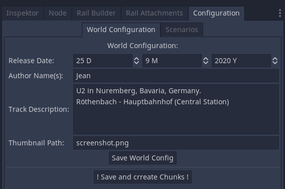
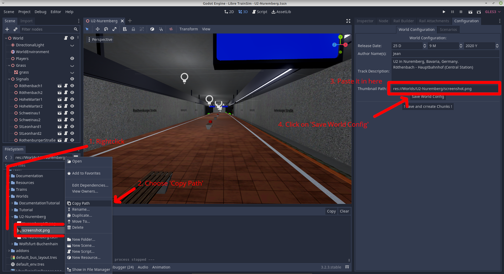

# World Configuration

!!! note "Docs merging note"
    What about moving that to export and publish. Needs new screenshots.

You can find the Basic World Settings under the tab 'Configuration'.

*Release Date*, *Authors Name(s)*, and *Track Description* should be self explaining.

You can also set a Thumbnail for your Track. It is shown while selecting the tracks, and while loading. So the .png file should have a high resolution such as 1920x1080 or higher.
Place the Thumbnail-File under res://Worlds/YourTrack/ as shown in the figure below:

