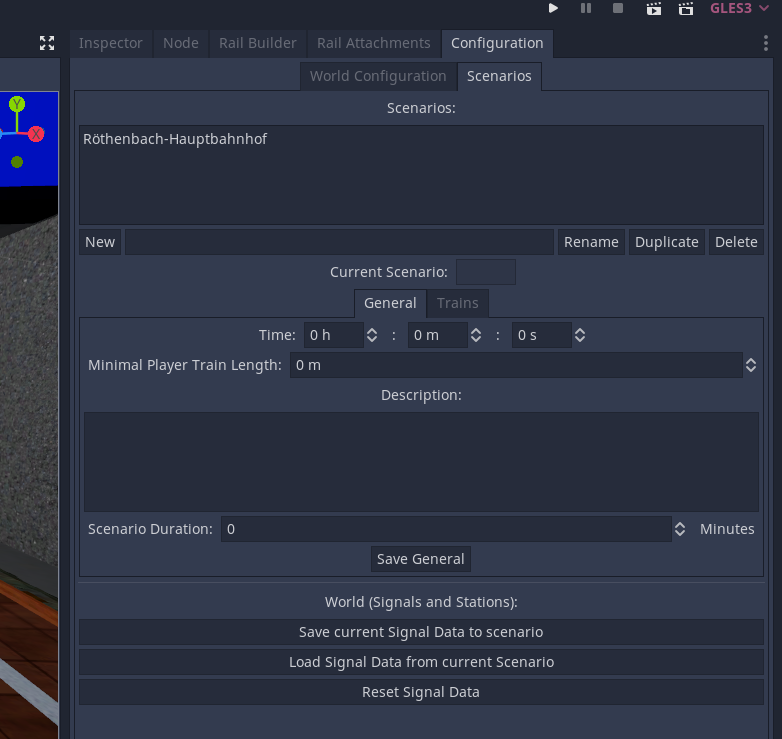
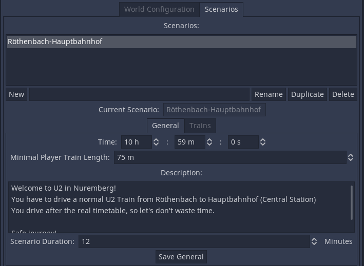
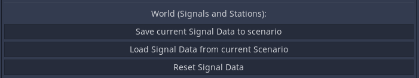
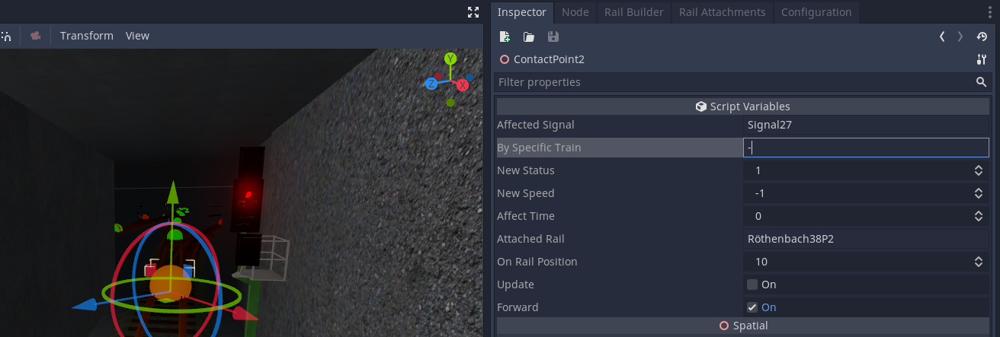
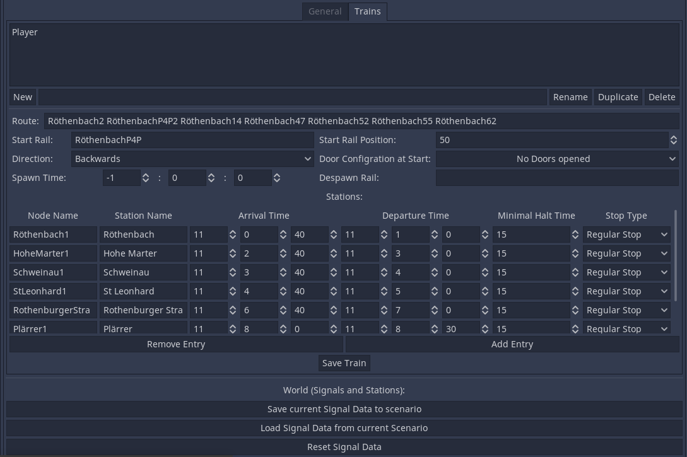
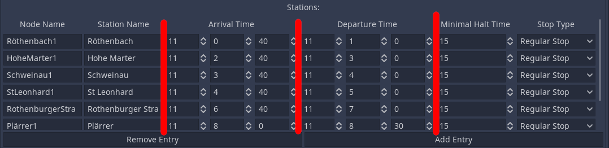

# Scenario Setup

!!! note "Docs merging note"
    Workflows changed. Needs new Screenshots. Content and language not verified.

In the Scenario Settings you define general thins like the time, but also the route and time table of a train.
Here you also will define NPCs. 

## Scenarios
You can create as many scenarios per track as you want. But scenarios don't save any custom objects or similar things. 
To edit a scenario, just simply select it from the list.

## General Settings
- Here you define the time, on which the scenarios starts. 
- Also you define the maximal length of the player train. A good value is the smallest station length - 25 m.
- The Description will be shown in the beginning of the scenario
- With the scenario duration displayed in the Main Menu, the player knows, how long this scenario will gonna be
- Don't forget to save your changes with 'Save General'

## Configuring Signals

In every scenario the signals could set to green at different ways, or behave different. 
- With 'Save current Signal Data to scenario' all Signal-Data of the world will be saved to the scenario.
- With 'Load Signal Data from current Scenario' all Signal Data of the scenario will be loaded in to the world.
- With 'Reset Signal Data' Every Signal will be set to default settings

*Attention*
You shouldn't remove or add any contact points on different scenarios. You can easily deactivate them by inserting "-" to 'By Specific Train'. (Provided that, that no train is called '-')

## Player Train

Please read [this](https://github.com/Libre-TrainSim/Libre-TrainSim/wiki/Testing-your-Track) article for configuring route, and start configuration. You can ignore 'Spawn Time' and 'Despawn Rail'

**Attention**: The train is only recognized as player train, if it is named 'Player'

### Timetable:

Now its getting funny: Here you define the timetable of the train. The order of the entries is very important, it won't be sorted at any time. 
- **Node Name**: Here you define the name of the Station-Node, over which the train will drive.
- **Station Name**: Thats the name of the station how it is displayed ingame.
- **Arrival Time**: Self explaining. The fields 11, 0, 40 stands for 11:00:40 (11 am and 40 seconds)
- **Departure Time**: Also self explaining. 
- **Minimal Halt Time**: Should be less or equal than Departure - Arrival. When the player arrives to late at the station, he has to hold at least the in here defined time. Unit: Seconds
- **Stop Type**:
    - Do not halt: The Train Station is displayed to the player, but he doesn't have to hold there.
    - Regular Stop: The default, if the player has to hold there, wait some time, and arrive
    - Beginning Station: Just select this at the first entry, and only if the player spawns in this station. If for example the player starts at a railway siding, and have to drive to his first station, select 'Regular Stop' instead.
    - End Station: Self explaining ;) Every Scenario should have an End Station in the end of the time table.
- **Waiting Persons**: Define how much percent of the normal people amount should wait at this station. Go for 100% at high frequented stations and lower for smaller ones.
- **Leaving Persons**: Defines, how much percent of the in the train will leave at this station. It's a bit random. 
- **Arrival Announce Path**: Path of a sound file. Will be played when train arrives at a station. Example: `res://Resources/Basic/Sounds/platform_endstation.ogg`
- **Departure Announce Path**: Path of a sound file. Will be played when train leaves at a station. Example: `res://Resources/Basic/Sounds/platform_departure.ogg`
- **Approach Announce Path**: Path of a sound file. Will be played before the train arrives at a station. Example: `res://Resources/Tutorials/Sounds/next_station_tutorialbach.ogg`

*(If you want recorded some station names by the speaker, just write to Jean28518)*

Don't forget to click on 'Save Train' in the end.