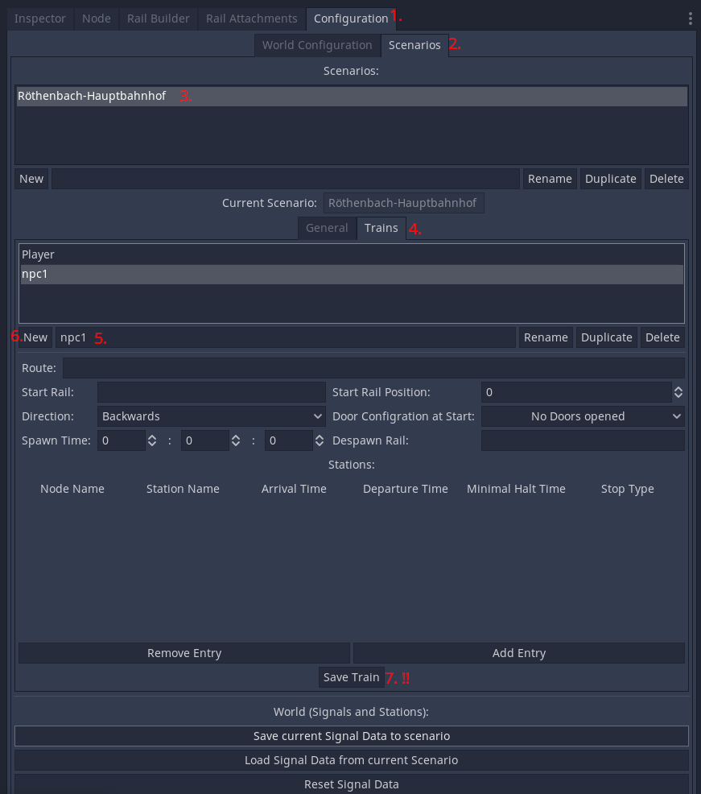
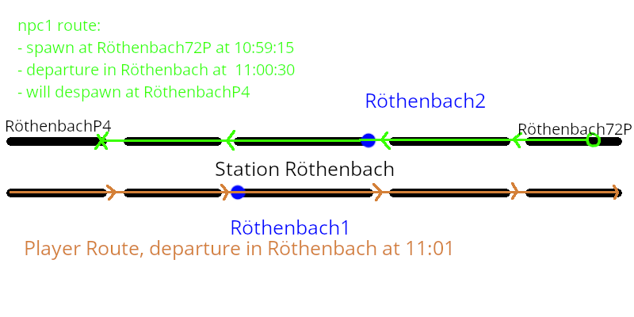
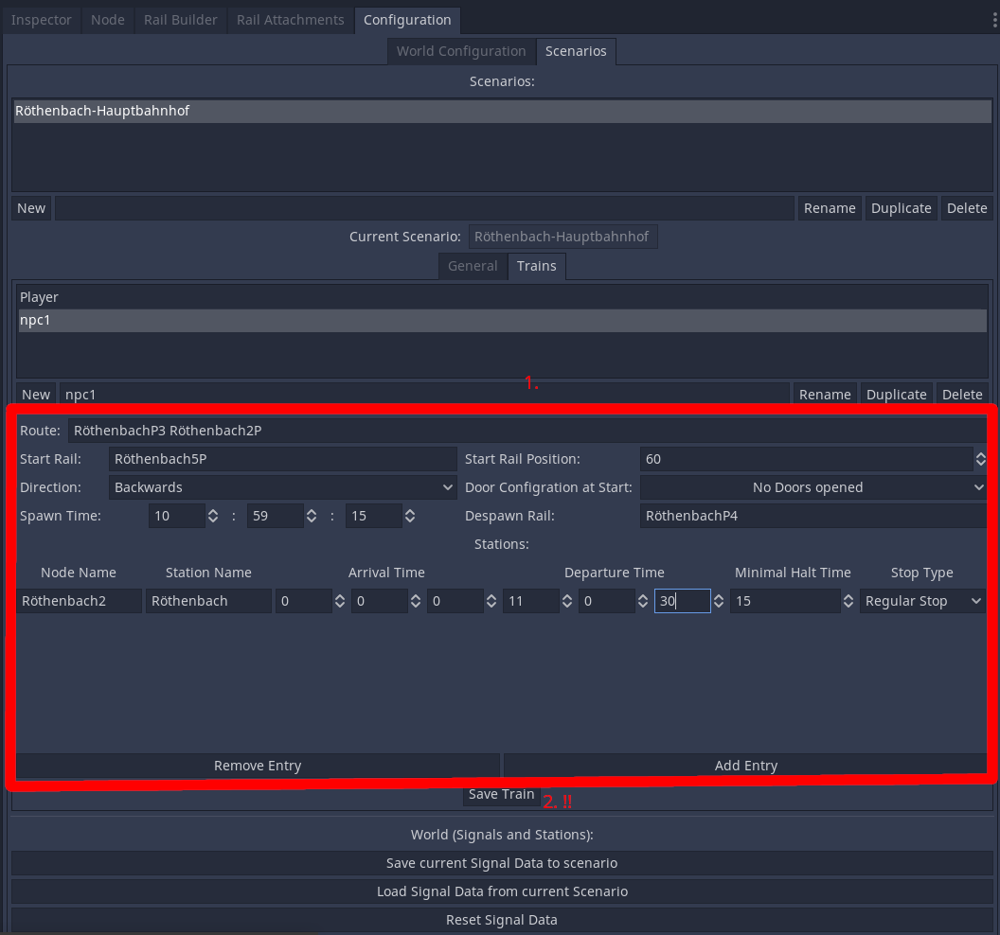

# Setup of NPC Trains

!!! note "Docs merging note"
    Falls together with the previous article. Since the workflow changed, I imagine they don't longer need to be seperate articles if the system spawns trains automatically.

    Screenshot outdated. Language and content not verified.

NPC trains are configured per scenario. Make sure to read [this article](10-scenario-setup.md) before adding any NPC train.

**The npc trains are defined only for driving at the track! This should not used, if the train has only to stand somewhere the whole time.**

## Adding new NPC train
For that define a name for the NPC train, and click on 'New'. 
But you could also click on 'Duplicate' if you want, so you may not add a whole timetable or route. 

## Settings
If you see, the settings are very similar to the settings of the player train.
The Train drives as a player would drive it. With stations, signals, timetable, and so on.
So you should configure them too.
But following variables are gonna be used by the npc train:
- **Spawn Time**: You have to configure this variable. It defines the the time, when the player npc should be created. So for example if your scenario starts at 11:00 am, its no problem, that a npc train is created at 11:10 am. 13 35 12 stands for 1:35 pm and 12 seconds.
The train will spawn at his start rail with the defined parameters as *Direction*, *Start Rail Position*, and *Door Configuration at Start*.
- **Despawn Rail**: If you want, that the npc train despawns, at a specific point, just insert here the name of the given rail. As the train touches this 'Despawn Rail', it will be removed from the world. Make sure, that the train reaches the Despawn Rail via the Route. 

## Example:

I want a train which drives in to a station, will halt, open the doors, departs, and despawns at a rail (green line in figure above).
1. First I create a new train, and define the route. 
2. Second I define the Start Position with Direction, and in my case the doors at the beginning are closed.
3. Then I define the Spawn time. The player will halt at 11:00:40, and depart at 11:01:00 at the opposite rail. So I define as Spawn Time. 10:59:15 pm
4. Then I define the Despawn Rail (Where the green X is)
5. Now I define the timetable of the train. I want only to halt at Röthenbach2 for some time until 11:00:30, and want to drive him further on. The Arrival Time at npc trains could be ignored.
6. **I click on 'Save Train'**

7. Now I configure the signals, over which the train will drive. (With pressing 'Load Signal Data form current Scenario' before and pressing 'Save current Signal Data to scenario' after.
8. Test it out! If there are any problems, you can fly around in the scene by pressing 0 Ingame.

