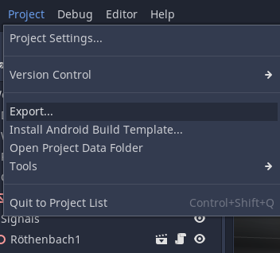
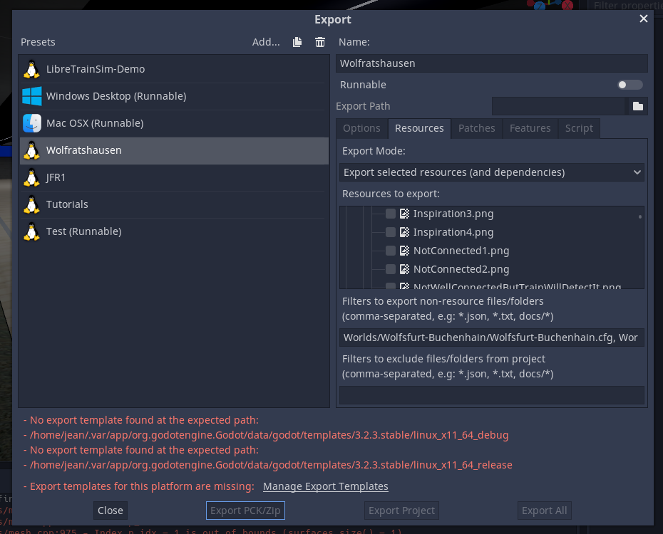
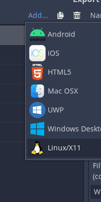
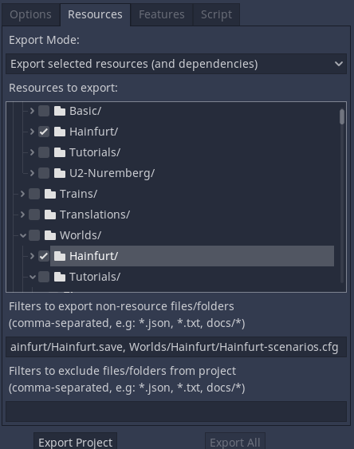
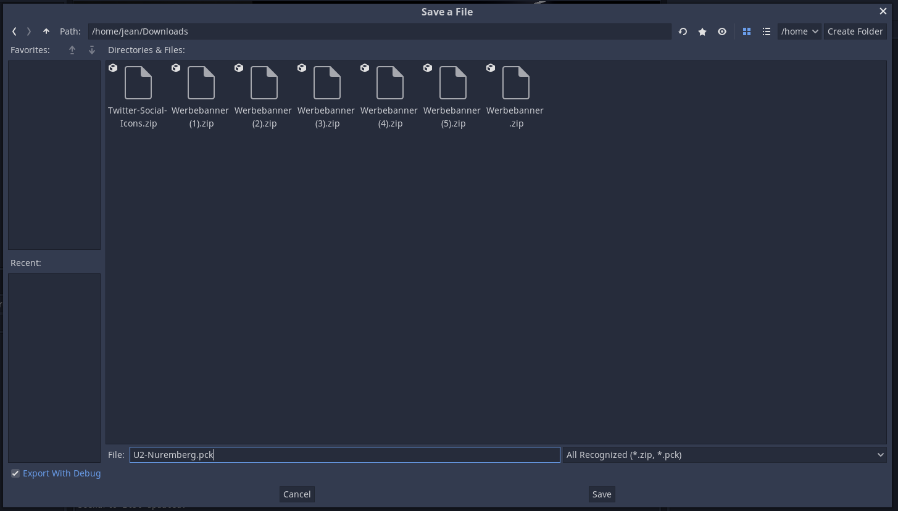
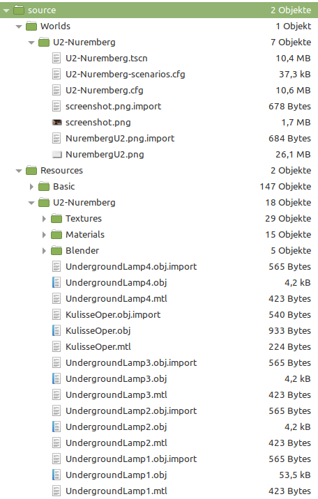
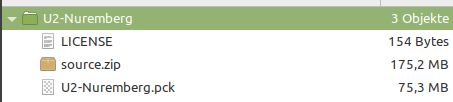

# Export and Publish

!!! note "Docs merging note"
    New workflow, too. Also let's replace the Google Form with a GH Link to a new repo in preparation for a mod portal.

    Content and language not verified.

So if your complete track is finished, let's export it!

**Please save and unload all chunks in the 'World Configuration' Tab before exporting!**

## Exporting Track

Select 'Project' -> 'Export...'. 



As seen below I don't have any export template downloaded. If this message shows up, click on 'Manage Export Templates', and download the appropriate export template. That cloud take a lot time.



After that you have to reopen 'Project' -> 'Export...'. Then add a new Template as seen below.



Give it an appropriate name.

Now define in the tab 'Resources':
- Export Mode: 'Export selected resources and dependencies'
    - Select in the window below `/Worlds/YourTrackName`
    - Select `Resources/YourTrackName`
    - ...
- Now you should define some non-resource files/folders: `Worlds/YourTrackName/YourTrackName.save, Worlds/YourTrackName/YourTrackName-scenarios.cfg`   *(Filenames changed since version 0.8!)*

In the end it should look like this:



Now click on `Export PCK/Zip` at the bottom of the window, select any folder (for example your own Downloads folder), and name it YourTrackName.pck.

**WARNING: It is very important that your TrackName is everywhere exact the same! If not, Libre TrainSim won't recognize it in the end.**

If it looks similar to the figure below, click 'Save' in the end.



After few seconds the export is finished, and you can test your packed track out in the real Libre TrainSim! 

## Licensing

It is recommended to add a license file to your work. Its completely up to you which license to take 

If you don't mind licenses, take [CC0](https://creativecommons.org/publicdomain/zero/1.0/). This License says: Everyone could do everything with it without any restrictions. 

If you want to be named as original author, and want, that modified tracks should be released under the same license, choose: [CC-BY-SA](https://creativecommons.org/licenses/by-sa/4.0/)

So create next to the .pck file a simple file named `LICENSE` and add for example following lines:
```
Track and Assets released under: CC0 (https://creativecommons.org/publicdomain/zero/1.0/)
Author: YOUR NAME
E-Mail: YOUR_E-MAIL_(Optional)
Source: libre-trainsim.de
``` 
*Of course you can design your LICENSE file as you want, it's your work! (Don't mind the Basic resources, they are released under CC0). But it is important to have a LICENSE file, because without it you can't upload it to libre-trainsim.de*

## Saving source files and packing upload file

So before uploading your track you should pack a source.zip file. In it there should be all files, you needed to create the track. (.png, .blend, .obj, .xcf, .gd, .tscn, .....). They are very important: If for example your track gets outdated, and someone want to update your track to the newest version, he will need the files in source.zip. With source.zip your track could live in etnerity ;)

Example of a source.zip file:



## Uploading

So in the end you should have these files:



Pack them to a zip-file, and upload them here: https://docs.google.com/forms/d/e/1FAIpQLSfWEB3gWOnqp9AoOlpxoZ2IdnbpTCr35xgMQSVgl9KEC0tiHw/viewform?usp=sf_link

