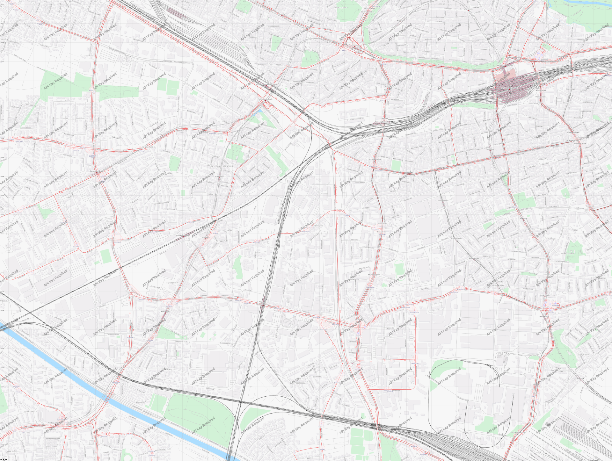

# First steps

## What type of track do I want to do?

Most readers probably already know what they want to build. Sadly, the more important question is if Libre TrainSim can actually handle your track at this stage.

!!! tip "A wholeheartedly advice on scope"
	You may have heard of term scope, or more precisely over-scope or over-scoping. This is a common pitfall when you start new projects. No one is safe from it. In fact, even settled developers regularly over-scope. Having committed over-scope is nothing you need to be ashamed of! It happens.
	
	Instead, your main concern *should* be to have something working as fast and small as possible. Either you end up having a somewhat usable and done project, or you have a blast and expand it further. Do yourself the favor and keep this advice close to your heart.

	At the beginning try to limit yourself to two or three stations that work and look great. That feels better than 15 stations that may work as well but don't look, or even worse don't work at all.

### Possible track types

  - Underground tracks
    - They need to stay underground though
    - ...or you mix both but crossing the ground results in an ugly transition through the ground.
  - Suburban/Urban Tacks
    - The previous documentation bragged that detailed cities are possible...
    - ... the question is the definition of "detailed".

!!! danger "Theory and practice"
	
	The bullet points below could very well be possible. **However**, take it with a good portion of salt (a grain of salt is probably not sufficent). **This is case of overselling untested facts.**
	
	They only remain here as warning for future contributers to manage expectations and to keep some gems of the original documentation.

  - "Simple" tracks, up to 100 km
    - First, no one ever tested that.
    - Second, even though the chunk system should be able to handle the size, keep in mind that this size still needs to be filled with content. There is no "Make game button".
  - Tramways
    - Could work, sure. But not with cars.
    - And, you need to make the street models first.
  - Any kind of freight routes
    - That is simply not true.
    - We only support passengers.
    - You can only drive from one driver's cabin an not switch between multiple.
    - We bake routes. We don't support switches and back and forth routes.
    - We don't have cargo trains nor cargo assets.
  - Hyper loop, mono rails, maglev tracks are possible, too.
    - You would need to create all required assets.
    - Nobody ever tested the claim.

### Track design limitations

  1. There is no landscape editor. Landscape is created by placing single objects into the scenery.
  2. Switching between underground and overground railways will put the ground plane between both parts. This is not a game play relevant issue but surely an artistic one.

## Conception phase

!!! warning

	That is impossible out of the box and requires a special setup using Godot, mod tools, the editing path put to `res://`, and constant switching between the in-game editor and Godot.

!!! note "Docs merging note"

	We should probably rewrite all of that. I stopped here.

It is highly recommended, that you make yourself a plan how you build your track. *(No shit, Sherlock)*
We will add a .png file to our floor of our track for orientating where to build tracks later.

### Fictional track

You could make your plan in a graphical Program like Inkscape, or even on a paper. Important is: In the end you will have a .png/jpeg File, which, we could add later to our track.

### Real-world track

You could download Maperative [here](http://maperitive.net/), Unzip it, (on Linux and Mac install Mono before), and start 'Mapertive.exe':

  1. Set to Transport Map: 'Tools' -> 'Add Web Map' -> 'Transport'
  2. Clear the Web Cache under 'Tools' -> 'Clear Web Tiles Cache'
  3. Zoom to your area, you want to snapshot
  4. Set Printing Bounds  under 'Map' -> 'Set Printing Bounds'
  5. Zoom out with the mouse wheel, and adjust the blue rect to your wanted *(Because our png image could be very large at the end, dont "mess up" the rect with unused space.)*
  6. For large tracks a scale of 1:64 458 is recommended (Displayed in the bottom left corner) - Just use the Mousewheel for that. Just apply a nearer zoom, if you really need it, or your track is small enough. *(Important: Memorize your applied scale, you will need it later! 
  7. Now generate the PNG File under 'Tools' -> 'Export to Bitmap' *(That could take up to 30 Minutes at big maps!)*
  8. In the end you can find your Image in the folder 'output' in the Maperative Directory.

Now we now should have a plan (.png) where to place some rails and where to place houses, Trees, ...

### Downscaled example

!!! note "Docs merging note"

	I would prefer a fictional example without all the noise.

!!! question "Where to put images?"

	We can either store images in a central `img` folder or store them next to the page. Personally, I'd prefer the latter.

## Height maps

!!! hint

	This is not a exhaustive list. If you feel like something is missing here, please open an [issue](https://github.com/Libre-TrainSim/lts-docs/issues/new).

### Germany

  - [Thuringia](https://de-de.topographic-map.com/maps/64wh/Th%C3%BCringen/)
  - [Saxony](https://www.geodaten.sachsen.de/digitale-hoehenmodelle-3994.html)
