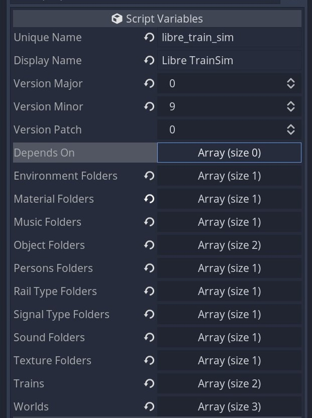

# Setup

!!! warning "Docs merging note"
    We need to update the help link in the LTS modding tools to point to this docs or update the webpage.

This page should inform you how to get started with LTS modding.
You will learn about mod creation, setup of the editor, getting the source, and exporting the mod.

# Getting the source

Libre Train Sim is available as [git repository](https://git-scm.com). You can either download the source of the latest release or clone the release branch. Cloning the release branch enables you to use git to update your LTS source in the future. While downloading the release source is easier, cloning the repository is easier to update when updates for the version are released.

## Downloading the release source

1. Go to https://github.com/Libre-TrainSim/Libre-TrainSim/releases and find the target version.
2. Open assets and download the source code.

## Cloning the code

!!! warning
    If you plan to version your changes, you should fork LTS first, clone your fork and checkout then. Follow the [pull request workflow instructions to learn more](/contribute/getting-started.md). The important bit of this section is the branch naming pattern used to distinguish release branches. It is `release/<version>`.

1. Ensure you have [git](https://git-scm.com) installed.
2. Open a shell in your target directory. On Windows you can press `Shift+RMB` to find a new entry called something along the lines: `Open terminal here` or `Open powershell here` or `Open command prompt here`.
3. Enter `git clone https://github.com/Libre-TrainSim/Libre-TrainSim/ lts` to clone the repository into the lts folder.
4. Switch to the lts folder `cd lts`.
5. Checkout the the target release branches. These branches are prefixed with `release/`. In order to get the 0.9 release source, type `git checkout release/0.9`

## Download and setup Godot

Before you can do anything meaningful with the code, you need to have Godot installed. Godot is the game engine that powers LTS. You can either [download Godot](https://godotengine.org/download/3.x/) or you install Godot using your package manager of choice. **Make sure to use Godot 3!** On Windows [scoop](https://scoop.sh) is viable choice.

If you are familiar with your command line and have set up Godot in your `PATH`, use `godot . -e` in the `lts/src` folder. Otherwise open Godot, select `Import Project` and select `lts/src`.

# Mod creation

Find the LTS Modding Tools panel. By default, it is be located as a tab next to the file system. Press `Create a new mod`. The new mod will be created in `res://mods/<unique_mod_name>`.

Mods have a config file named `content.tres`. This file will be exported as a seperate file next to the pack. It is used to get information about the content pack before loading it. The names are populated with the data entered in the creation menu. You can also set the mod version in this file and other mods your mod is depending on. The version will be used to check if the depencies are satisfied.

There are couple of folders that can be configured.

 * `Environment Folders` - no use?
 * `Material Folders` - Use only for materials that are used for rail attachments. Please note that proper textures are specific to the mesh (UV map). Reusing materials by not creating UV maps will result in bad visuals. Only necessary for materials that should appear in the ingame editor.
 * `Music Folders` - no use?
 * `Object Folders` - Has dual use for finding object groups (these will be queried for the actual scenes so your objects can have any folder structure you may like.) and the mesh files used for rail attachments. Only necessary for objects that should appear in the ingame editor.
 * `Persons Folders` - no use? May simply spawn other people?
 * `Rail Type Folders` - no use? May add more rails (these need to be changed for each visual instance in the editor)
 * `Signal Type Folders` - no use?
 * `Sound Folders` Only necessary if sound files need to be selectable in the ingame editor.
 * `Texture Folders` - no use

!!! danger
    We should remove unused folders!

Lastely trains and worlds are referenced. Resource references are saved in the train and world files.

# Mod export

Find the mod tools and press `Export a mod`. Select the folder of the mod you want to export. The mod will be exported to the addons directory. To distribute the mod, you need to share the whole mod folder.

# Testing mods in editor builds

Godot can't reliably load pack files when it operates as editor. As a consequence we disabled mod loading at run-time for these builds. To test your mod, you need to append the folders, trains, and worlds to the LTS `res://content.tres`. Doing so effectively makes your mod base game but as long as you don't have dependencies (on packed mods) there is no issue.

!!! note
    It would be nice to do that automatically for mods in source mode though.